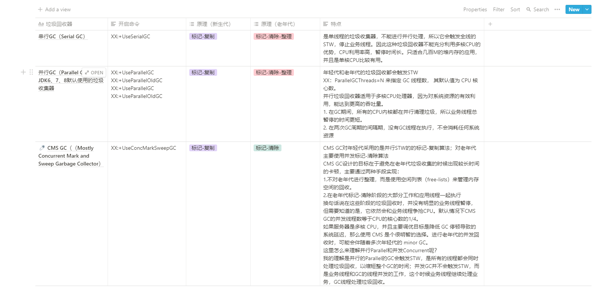
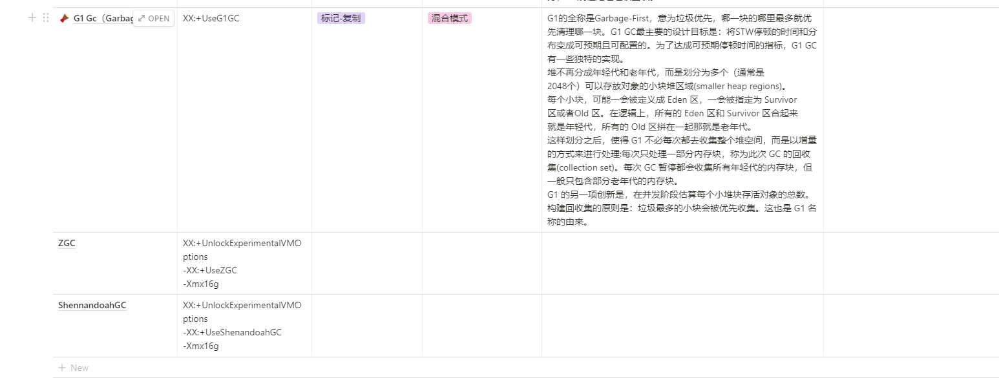

# GC的总结
> 学完了前两周的内容，根据我个人的理解，从各个角度对目前学到的常见的GC做一个总结

首先将上课笔记中的内容做一个整理，整理图片如下：

从堆的角度，不同的GC策略总结：
* Serial GC:堆分为年轻代和老年代，年轻代垃圾回收采用的是标记-复制原理，S0、S1也叫做from、to，也就是发生复制的过程，也说明S0和S1总有一个区为空；老年代垃圾回收采用的是标记-清除-整理，有一个整理压缩老年代内存的过程，防止内存碎片化。
* Parallel GC：堆的分布和垃圾回收原理Serial GC一样，只不过整个垃圾回收的过程变成了并行化。堆分为年轻代和老年代，年轻代垃圾回收采用的是标记-复制原理，S0、S1也叫做from、to，也就是发生复制的过程，也说明S0和S1总有一个区为空；老年代垃圾回收采用的是标记-清除-整理，有一个整理压缩老年代内存的过程，防止内存碎片化。
* CMS GC:堆分为年轻代和老年代，年轻代垃圾回收采用的是标记-复制，理解和上面的一样，需要注意的是CMS GC老年代采用的是标记-清除，没有整理压缩的过程，所以它可能会带来老年代内存碎片化。
* G1 GC：没有明确意义的年轻代和老年代，堆被分为了堆块，但是有逻辑上的年轻代和老年代，比如说对象存活的时间。对于年轻代的回收，采用的是标记-复制的原理，老年代则是混合模式，并发标记过程和CMS类似。

针对每种GC的侧重点不同，对各个GC的各个阶段STW汇总：
> youngGC就是对堆内存中young区的垃圾回收，oldGC就是对堆内存中old区的垃圾回收，FullGC就是对整个堆内存进行垃圾回收
* Serial GC：Young GC整个过程STW；Full GC整个过程STW
* Parallel GC：Young GC整个过程STW；Full GC整个过程STW
* CMS GC:Young GC整个过程STW；Old GC只有两个小阶段STW；Full GC整个过程STW
* G1 GC：Young GC整个过程STW；Mixed GC由全局并发标记和对象复制组成，全局并发标记其中两个小阶段STW，其它并发；Full GC整个过程STW
* Shenandoah GC/ZGC：他们都是回收堆的一部分，所以没有FullGC的概念

从之前GC执行的过程和日志来看：
* Serial GC：串行GC执行的过程相对简单，整个GC过程都是单线程的，所以GC执行的效率相对较低，单位时间内创建对象的个数也是比较少的，它有一个改进的版本叫做ParNewGC，一般配合CMS GC使用，即CMS GC过程中对年轻代的垃圾回收。
* Parallel GC：这是JDK6、7、8默认的GC策略，整个GC过程中是并行的，也就说多个GC线程同时处理垃圾，加快垃圾回收的效率。
* CMS GC：特点很明显，它追求系统的响应速度，确保每次GC的时间尽量短
* G1 GC：JDK9开始默认的GC策略，和并发标记的过程和CMS GC的过程很类似，但是我给它打的标签就是最大限度的自主可控，提供了超级多的可配置参数，可以控制GC发生的时机，可以控制GC的时间等，整个GC过程整体可控。
* Shenandoah GC/ZGC：G1 GC的改进版本，JDK11新出现的GC，通过多个版本的优化，现在已经达到了正式生产使用的水平。

从GC之前的搭配和选择使用来说（基本上都是自己理解后的总结，口语化表达）：
* 如果堆内存较大，非常推荐使用G1 GC，这个我觉得可以这样来理解，G1 GC本来就没有严格意义上的年轻代、老年代，它是将堆划分为大小不同的堆块，每个堆块代表逻辑上的年轻代、老年代，回收也是通过标记回收集来对堆块进行回收，堆内存较大，可供分配的堆块就越多，整个GC就越是可控，发生GC的频率也不会很频繁。
* 如果考虑吞吐量优先，堆内存不是很大，CPU的资源一般都用来处理业务，没什么好说的，Parallel GC，并行的，GC的时候多个线程处理，GC时间短，不GC的时候GC线程不消耗资源，最大限度的保证系统资源都用来处理业务
* 如果希望GC整体可控，不想想，看到可控，先考虑G1 GC吧，那么多可配置的参数，先研究一下吧。
* 如果确保响应速度，每次GC的时间较短，优先CMS GC，这里我的理解是CMS并发标记的阶段，其实只有两个小阶段是STW的，也就是说大部分时间即使在GC的过程中，业务线程也是运行着的，这样就可以确保更短时间的STW，确保响应的时间更短，因为没有那么多STW，就意味着最大限度的保证更多的时间业务系统都有响应。

自己对于GC的理解
* 任何脱离了实际业务和场景的谈性能都是刷流氓，一切的GC优化，JVM调优都是针对实际的业务来说的，没有一个标准答案，只是有一些大致方向。
* 学习了目前主流的GC策略，也是了解了其背后的原理，目前都是基于理论的，具体的应用和调优还是需要我们自己在实际的工作中不断的摸索和总结经验，才能形成自己的JVM调优方法。