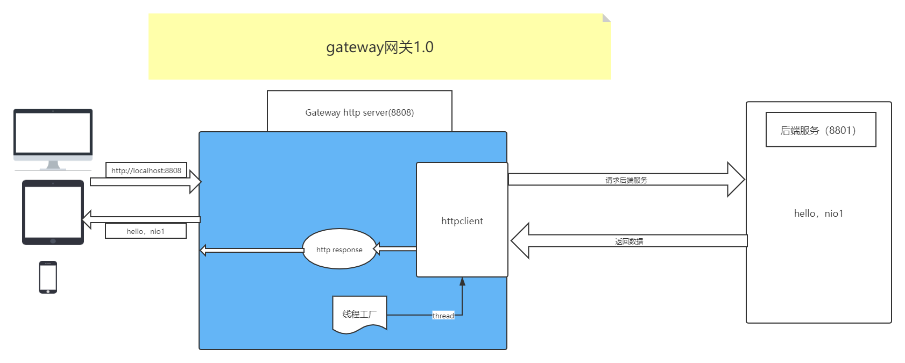

# gateway1.0

> 基于Netty的网关1.0实现

## 后端服务
server文件夹下面HttpServer01，这里代表后端真实的业务服务，即客户端要访问的真正的业务服务。

## 网关实现
使用Netty实现一个简易网关。Netty实现一个HTTPServer接收客户端的请求服务，然后通过httpclient去请求后端的服务，拿到响应后构造一个HTTPResponse返回给客户端。
httpclient在请求后端服务的时，为了减小系统消耗，这里使用线程池开启一个线程使用httpclient向后端服务发送请求。
gateway1.0中，这里向后端请求服务使用httpclient。其他的例如netty client或者okhttp实现方式同理。

## 业务流程图
