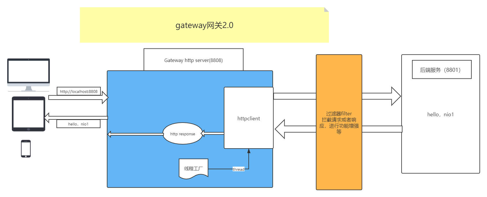
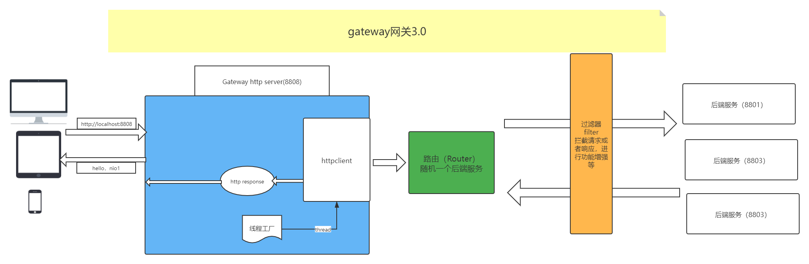

# gateway2.0

> 基于Netty的网关2.0实现，增加过滤器 
> 本周作业第3题实现一个过滤器，第4题实现一个路由，由于基础服代码相同，所以这两题作业均放在次目录下完成。

## 网关实现
在网关1.0的基础上增加了过滤器
http request的过滤器，可以拦截请求、以及对请求做增强或者添加安全校验机制等
http response的过滤器，同样可以增强给客户端的响应，或者拦截到一部分的响应等

## 业务流程图

# gatewat3.0
> 基于Netty的网关3.0实现，实现路由，以实现高可用

## 网关实现
增加了路由。同时启动三个后端服务HTTPServer01、HTTPServer02、HTTPServer03，路由采取的策略是随机策略，即随机请求一个后端服务。
启动网关服务，请求网关服务，发现随机返回hello, nio1，hello, nio2，hello, nio3，说明路由生效。

## 业务流程图
